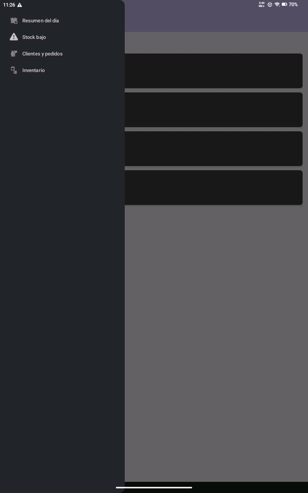
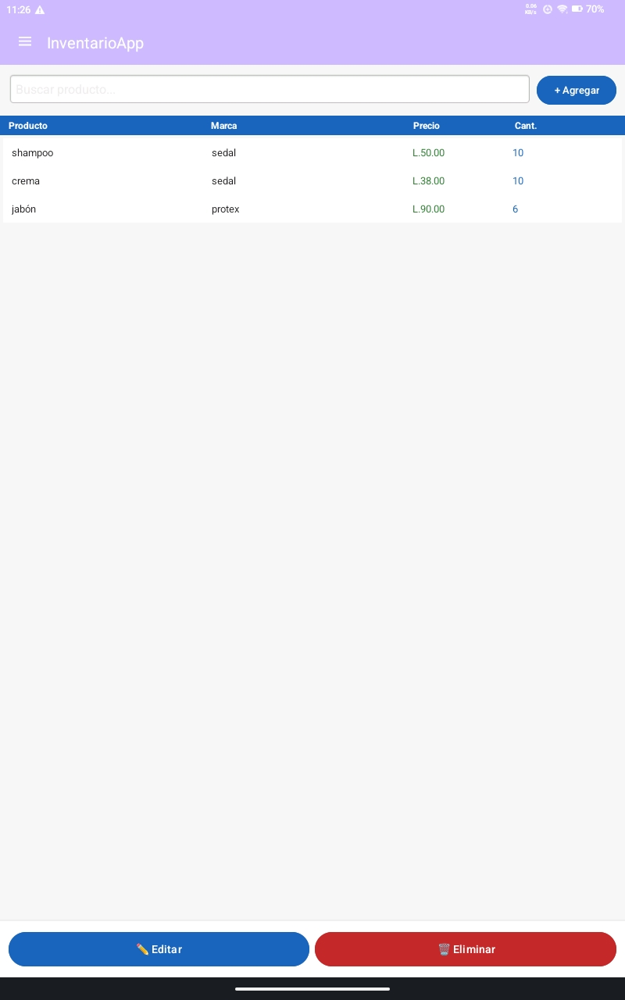
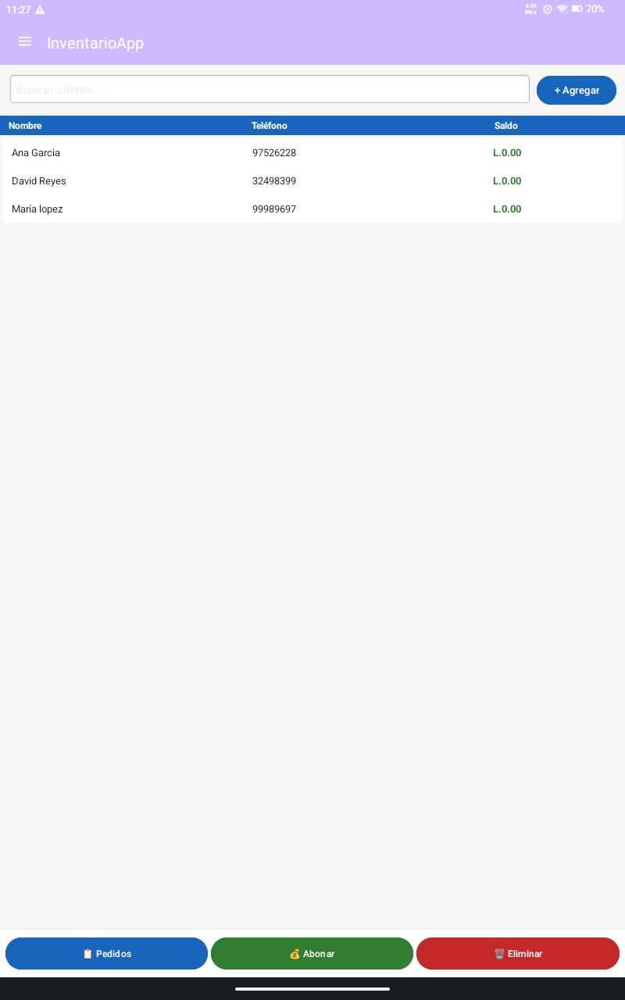
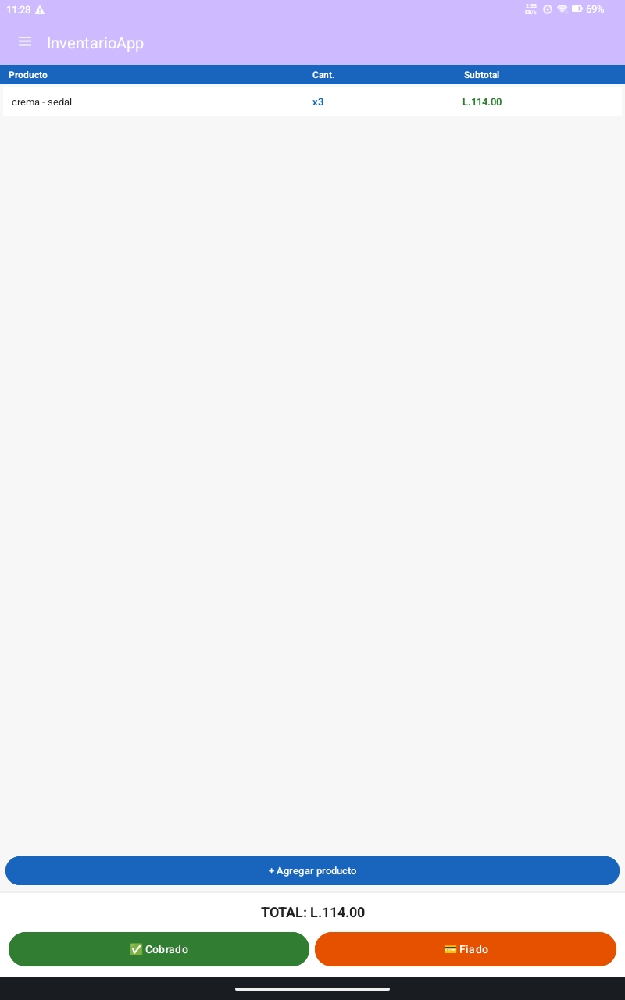

# 📦 InventarioApp

A mobile inventory and order management system built in Java for Android, designed for small businesses. No login required — open the app and start working immediately.

> Built as a real-world solution for a small retail business. Designed for simplicity and offline-first reliability.

---

## 📱 Screenshots

| Menu | Inventory | Customers | Order Detail |
|------|-----------|-----------|--------------|
|  |  |  |  |

---

## 🚀 Features

### 📋 Customers & Orders
- Register customers with name and phone number
- Create orders per customer — select products and quantities from inventory
- Mark orders as **Cobrado (Paid)** or **Fiado (Credit)**
- View pending balance per customer at a glance
- Accept partial payments and track remaining balance

### 🗃️ Inventory Management
- Add products with name, brand, price, and stock quantity
- Edit price and quantity at any time
- **Automatic low stock alert** when a product drops below 5 units
- Stock updates automatically after every sale

### 📊 Daily Dashboard (Resumen del día)
- Total merchandise value in stock
- Total amount owed across all customers
- Low stock products highlighted for quick action

### ⚠️ Low Stock Screen
- Dedicated view showing all products below minimum threshold
- Updates in real time after every purchase

### ☁️ Offline-First with Cloud Sync
- All data stored locally using **SQLite** — works 100% offline
- When internet is detected, data syncs automatically with **Firebase**
- No manual configuration — the switch between local and cloud is seamless

---

## 🛠️ Tech Stack

| Technology | Usage |
|------------|-------|
| Java | Core application logic |
| Android SDK | Mobile UI and navigation |
| SQLite | Local offline database |
| Firebase Realtime Database | Cloud sync when online |

---

## ▶️ How to Run

1. Clone the repository:
```bash
git clone https://github.com/Davidreyesd13/InventarioApp.git
```

2. Open in **Android Studio**

3. Run on an emulator or physical Android device

4. No login required — the app opens directly to the inventory screen

> **Firebase sync** activates automatically when an internet connection is available. The app is fully functional offline without it.

---

## 📁 Project Structure

```
InventarioApp/
├── app/
│   ├── src/main/java/       # Java source files
│   ├── res/layout/          # XML layouts
│   └── AndroidManifest.xml
├── google-services.json     # Firebase config
└── build.gradle
```

---

## 👤 Author

**David Fernando Reyes Díaz**  
Systems Engineering Student | Android & Java Developer  
[GitHub](https://github.com/Davidreyesd13) · [Upwork](https://www.upwork.com/freelancers/~01081d9ffc5d261e0e)
